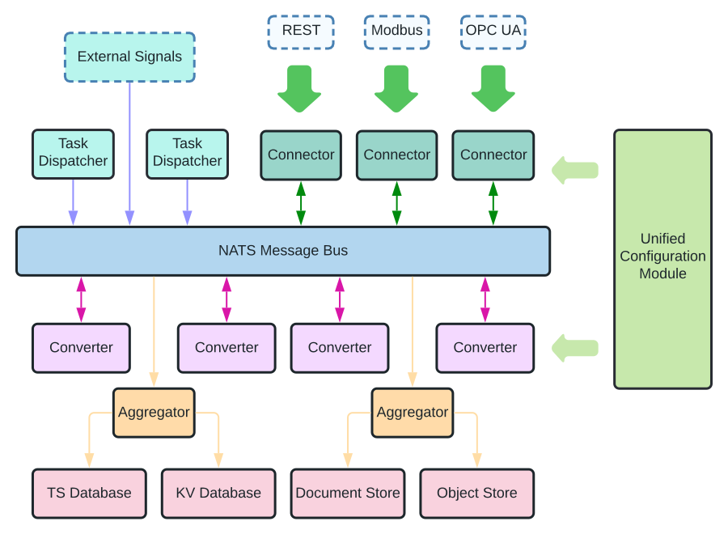

# Architecture

<figure markdown>
{width="600"}
</figure>

There are three types roles in the system:

1. `Dispatcher`: dispatcher triggers data collection tasks and divides the data points to be fetched to small batches.
1. `Connector`: connecter connects to a data source through specific communication protocol.
1. `Converter`: converter processes and transforms the data fetched by the connectors to data format that can be
   accepted by storages. Multiple converters can be applied sequentially. For example, there can be one converter to
   append timestamps and another converter to add additional meta information.

There can be multiple instances for each role types, and they can communicate with each other through a NATS message
bus. Each role instance subscribes the topic of `karez.{role_type}.{role_name}` in the queue `{role_type}.{role_name}`.
For example, a connector named "virtgen_conn" will subscribe the topic `karez.connector.virtgen_conn` in the
queue `connector.virtgen_coon`.

Theoretically, one can also put all the data post-processing work in the connectors. There is no compulsive rule for
which work must be implemented as converters. However, it would be a good practice to keep a connector as simple as
possible to maximise the data retrieving performances. Also, it is easy to set up multiple converters to parallelise
some heavy data processing procedures.

Users can implement own dispatchers, connectors, and/or converters. The system will automatically search for all
required plugins in the `plugins` directories.
